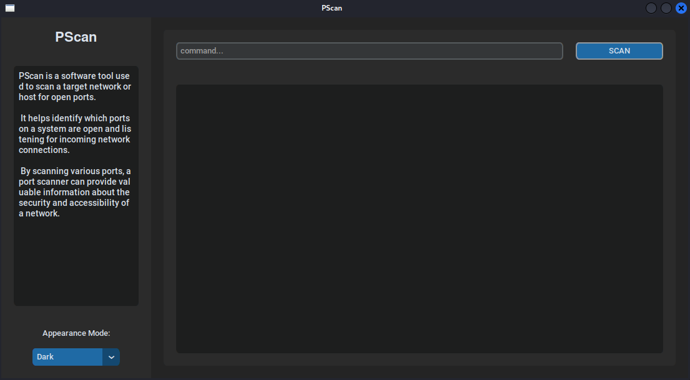
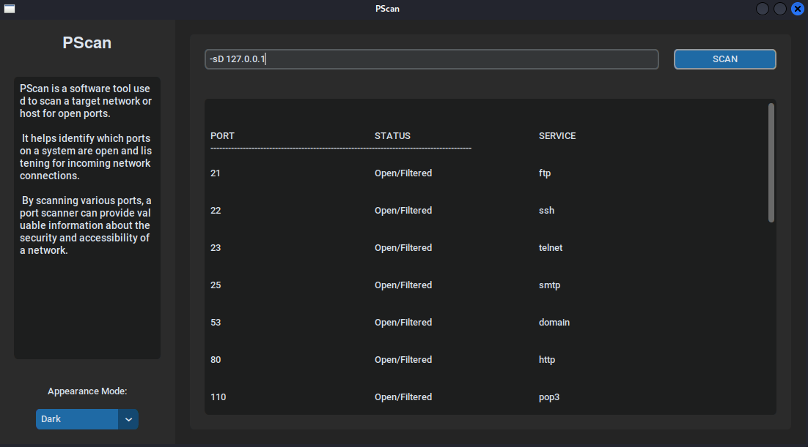
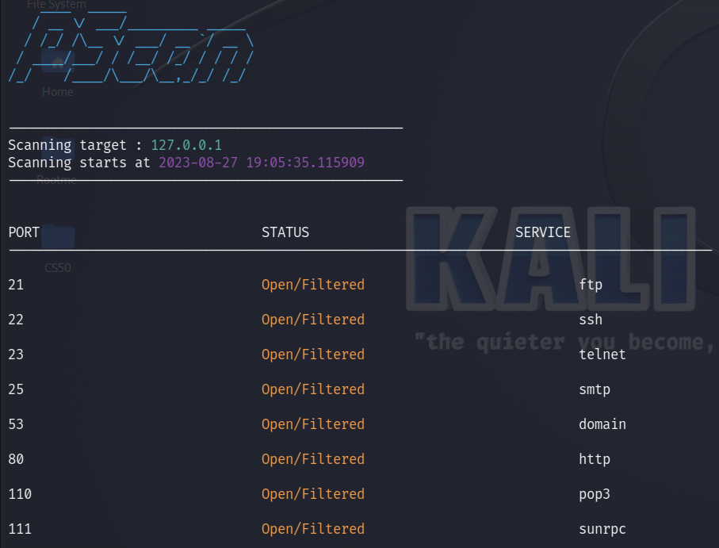

# PScan
- CS50 final project [Harverd edx](https://pll.harvard.edu/course/cs50-introduction-computer-science?delta=0)



## Description
**PScan** is a powerful port scanning tool designed to provide comprehensive network analysis and security assessment. With its capabilities, PScan allows users to scan target systems for open/ filtered/close ports and identify potential vulnerabilities, making it an essential tool for network administrators, penetration testers.

Key Features of **PScan** :
1. *Port Discovery* : PScan employs a robust scanning engine that efficiently discovers open ports on target systems. By systematically scanning a range of ports, it provides valuable information about the services running on those ports, which aids in the identification of potential security risks.
2. *User-Friendly Interface* : PScan features an intuitive and user-friendly interface that simplifies the scanning process. It offers both command-line and graphical user interface (GUI) options, allowing users to choose the interface that best suits their preferences and expertise.
3. *Scan Options* : PScan offers options to cater to different requirements. Users can perform default scan on specific ports (Top 20 most scanned ports in cybersecurity) or choose another option.

## Tools and libraries
The programing language used to implement this project is **Python**.
- *Socket* : python library that allows to send messages across a network.
- *Scapy* : powerful interactive packet manipulation library written in Python. Scapy is able to forge or decode packets of a wide number of protocols, send them on the wire, capture them, match requests and replies...
- *Customtkinter* :  is a python UI-library based on Tkinter, which provides new, modern and fully customizable widgets.
- *Colorama* : is a cross-platform library that simplifies the process of adding color to terminal text.
- *Pyfiglet* : it takes ASCII text and renders it in ASCII art fonts (like  
the title above, which is the 'block' font).

## Conception
This tool is built using **Pyhton** and some important libraries, so it is based on a class called *portScanner* that contains multiples functions for scanning modes :
```python
class portScanner():

    def __init__(self, target):

        # Target to scan
        self.target = target

        # List of ports to scan (top 20 most scanned ports)
        self.ports = [21, 22, 23, 25, 53, 80, 110, 111, 135, 139, 143, 443, 445, 993, 995, 1723, 3306, 3389, 5900, 8080]
```

- *Default scanner mode :*
```python
def defaultScan(self):

        result = ""
        for port in self.ports:

            # Use a random port as the source port
            sourcePort = random.randint(1, 10000)

            # Send a TCP packet to the port with SYN flag
            scanstealthResponse = sc.sr1(sc.IP(dst=self.target)/sc.TCP(sport=sourcePort, dport=port, flags="S"), timeout=1, verbose=False)

            if not scanstealthResponse:
                result = result + self.printResult(port, "Open/Filtered") + "\n"
                continue

            if scanstealthResponse and scanstealthResponse.haslayer(sc.TCP):
                flag = scanstealthResponse[sc.TCP].flags

                # If the flag is SA (SYN-ACK) that means the port is open
                if flag == "SA":
                    sendReset = sc.sr(sc.IP(dst=self.target) / sc.TCP(sport=80, dport=port, flags="AR"), timeout=1, verbose=False)
                    result = result + self.printResult(port, "Open") + "\n"

                elif flag == 0x14:
                    result = result + self.printResult(port, "Close") + "\n"

                elif flag == "RA":
                    continue

            # Here we check if the packet has a icmp layer, that means it may be filtered
            if scanstealthResponse and scanstealthResponse.haslayer(scli.ICMP):

                # list of filter codes
                filterCodes = [1, 2, 3, 9, 10, 13]

                if scanstealthResponse[scli.ICMP].type == 3 and scanstealthResponse[scli.ICMP].code in filterCodes:
                    result = result + self.printResult(port, "Filtered") + "\n"
                    continue

        return result
```

- *Xmas scanner mode :*
```python
def xmasScan(self):

        result = ""
        for port in self.ports:

            # Use a random port as the source port
            sourcePort = random.randint(1, 10000)

            # Send a TCP packet with FPU flag which makes it a xmas scan
            xmasResponse = sc.sr1(sc.IP(dst=self.target)/sc.TCP(sport=sourcePort, dport=port, flags="FPU"), timeout=1, verbose=False)

            # Now, if there's no reponse, so the port is open or filtered
            if not xmasResponse:
                result = result + self.printResult(port, "Open/Filtered") + "\n"

            elif xmasResponse.haslayer(sc.TCP):

                if xmasResponse[sc.TCP].flags == 0x14:
                    result = result + self.printResult(port, "Close") + "\n"

            elif xmasResponse.haslayer(scli.ICMP):
                filterCodes = [1, 2, 3, 9, 10, 13]

                if xmasResponse[scli.ICMP].type == 3 and xmasResponse[scli.ICMP].code in filterCodes:
                    result = result + self.printResult(port, "Filtered") + "\n"
                    continue

        return result
```

- *Null scanning mode :*
```python
def nullScan(self):

        result = ""
        for port in self.ports:

            # Use a random port as the source port
            sourcePort = random.randint(1, 10000)

            # Send a TCP packet with no flags
            nullResponse = sc.sr1(sc.IP(dst=self.target)/sc.TCP(sport=sourcePort, dport=port, flags=""), timeout=1, verbose=False)

            # Now, if there's no reponse, so the port is open or filtered
            if not nullResponse:
                result = result + self.printResult(port, "Open/Filtered") + "\n"

            elif nullResponse.haslayer(sc.TCP):

                if nullResponse[sc.TCP].flags == 0x14:
                    result = result + self.printResult(port, "Close") + "\n"

            elif nullResponse.haslayer(scli.ICMP):
                filterCodes = [1, 2, 3, 9, 10, 13]

                if nullResponse[scli.ICMP].type == 3 and nullResponse[scli.ICMP].code in filterCodes:
                    result = result + self.printResult(port, "Filtered") + "\n"
                    continue

        return result
```

- *ACK scanning mode :*
```python
def ackScan(self):

        result = ""
        for port in self.ports:

            # Use a random port as the source port
            sourcePort = random.randint(1, 10000)
            ackResponse = sc.sr1(sc.IP(dst=self.target)/sc.TCP(sport=sourcePort, dport=port, flags="A"), timeout=1, verbose=False)

            if not ackResponse:
                result = result + self.printResult(port, "Filtered") + "\n"

            elif ackResponse.haslayer(sc.TCP):

                if ackResponse[sc.TCP].flags == 0x4:
                    continue

            elif ackResponse.haslayer(scli.ICMP):
                filterCodes = [1, 2, 3, 9, 10, 13]

                if ackResponse[scli.ICMP].type == 3 and ackResponse[scli.ICMP].code in filterCodes:
                    result = result + self.printResult(port, "Filtered") + "\n"
                    continue

  

        return result
```

And we have a function to print the result :
```python
def printResult(self, port, status):

        if status == "Open":
            try:
                service = socket.getservbyport(port)
            except OSError:
                service = "////"
            return (f"\r{str(port)}\t\t\t\tOpen\t\t\t\t{service}\n")

        elif status == "Filtered":
            return (f"\r{str(port)}\t\t\t\tFiltered\t\t\t\t \n")

        elif status == "Close":
            return (f"\r{str(port)}\t\t\t\tClose\t\t\t\t \n")

        elif status == "Open/Filtered":
            try:
                service = socket.getservbyport(port)
            except OSError:
                service = "////"
            return (f"\r{str(port)}\t\t\t\tOpen/Filtered\t\t\t\t{service}\n")
```

And 
```python
def resultTable(self):
        return ("\n\nPORT\t\t\t\tSTATUS\t\t\t\tSERVICE\n-----------------------------------------------------------------------------------------\n")
```

## Running
Let's start by installing the necessary libraries through `requirements.txt` file :
```
pip install -r requirements.txt
```

As we said, there is two version of **PScan**, command-line and GUI
- Command-line :
```
sudo python3 app.py [MODE] [TARGET]
```

- GUI :
```
sudo python3 appGUI.py
```

Set the mode and the target on the entry field of the app and press SCAN :


## Result
- GUI


- Command-Line

